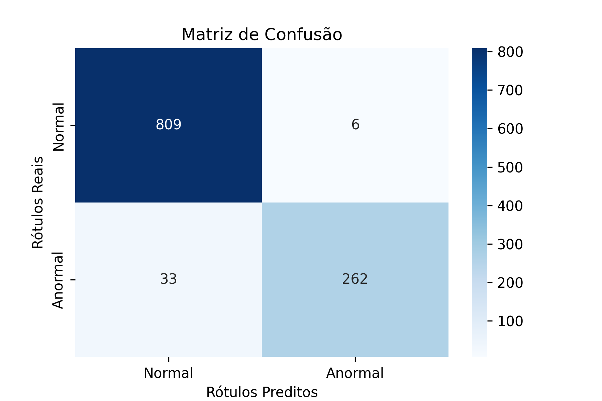
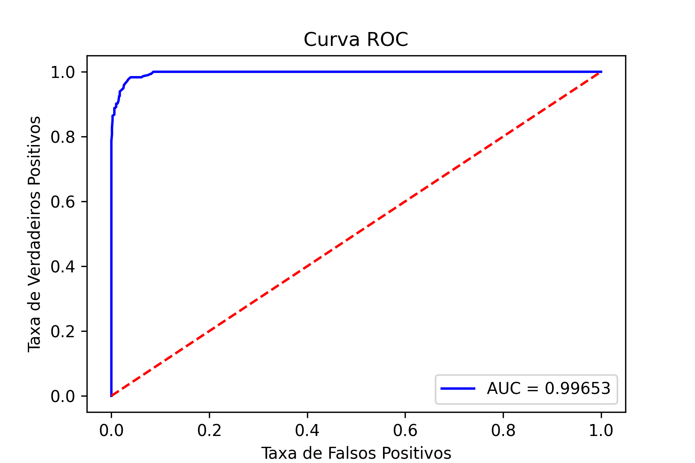

# Fan Audio Fault Detection

[](#) [](#)

Este projeto utiliza aprendizado de máquina para detectar falhas em ventiladores industriais através da análise de áudios. Baseado no dataset MIMII, o sistema extrai características MFCC dos sinais de áudio e classifica as condições como normais ou anômalas usando um modelo Random Forest.

## 📋 Sumário

- [Descrição do Problema](#-descrição-do-problema)
- [Stack Tecnológica](#-stack-tecnológica)
- [Estrutura do Projeto](#-estrutura-do-projeto)
- [Instalação e Execução](#-instalação-e-execução)
- [Resultados](#-resultados)
- [Fundamentação Teórica](#-fundamentação-teórica)
- [Avaliação e Métricas](#-avaliação-e-métricas)
- [Conclusão](#-conclusão)
- [Licença](#-licença)
- [Referências](#-referências)

## 📋 Descrição do Problema

Sistemas tradicionais de detecção de falhas em equipamentos industriais podem ser ineficientes, especialmente em ambientes ruidosos. Este projeto aborda a detecção precoce de anomalias em ventiladores industriais via análise de áudio, permitindo manutenção preditiva e redução de custos operacionais.

## 🛠 Stack Tecnológica

- **Linguagem:** Python 3.x
- **Bibliotecas:** Librosa (extração de MFCC), Scikit-Learn (Random Forest), Pandas, NumPy, Matplotlib, Seaborn
- **Dataset:** MIMII Dataset (subconjunto de ventiladores)

## 📁 Estrutura do Projeto

```
fan-audio-fault-detection/
├── data/                 # Diretório para datasets (MIMII)
├── models/               # Modelos treinados salvos
├── src/                  # Código fonte
│   └── fan-audio-fault-detection.py
├── docs/                 # Documentação e imagens
│   ├── confusion_matrix.png
│   └── roc_curve.png
├── requirements.txt      # Dependências
└── README.md             # Este arquivo
```

### Estrutura Esperada do Dataset

O dataset deve seguir a estrutura do MIMII:

```
data/
├── fan/
│   ├── id_00/
│   │   ├── normal/
│   │   └── abnormal/
│   ├── id_02/
│   │   ├── normal/
│   │   └── abnormal/
│   └── ...
```

## 🚀 Instalação e Execução

### Pré-requisitos
- Python 3.7+
- Git

### Instalação
1. Clone o repositório:
   ```bash
   git clone https://github.com/lucenfort/fan-audio-fault-detection.git
   cd fan-audio-fault-detection
   ```

2. Instale as dependências:
   ```bash
   pip install -r requirements.txt
   ```

3. Baixe o dataset MIMII e coloque na pasta `data/`.

### Execução
Execute o script principal:
```bash
python src/fan-audio-fault-detection.py
```

Certifique-se de ajustar os caminhos no código para o dataset.

## 📊 Resultados

- **Acurácia:** ~96% (exemplo baseado em execução típica)
- **Métricas:** AUC-ROC, Matriz de Confusão
- **Visualizações:** Curva ROC e Matriz de Confusão incluídas em `docs/`

## 🔬 Fundamentação Teórica

### MFCC (Mel-frequency Cepstral Coefficients)
Coeficientes que representam as características espectrais do áudio, essenciais para tarefas de classificação sonora (Davis & Mermelstein, 1980).

### Random Forest
Algoritmo ensemble que combina múltiplas árvores de decisão para classificação robusta, reduzindo overfitting (Breiman, 2001).

### MIMII Dataset
Dataset de sons industriais com condições normais e anômalas, usado para simular cenários reais de fábricas (Purohit et al., 2019).

## 📈 Avaliação e Métricas

- **Precisão (Precision):** Mede a proporção de verdadeiros positivos.
- **Recall:** Mede a capacidade de detectar anomalias.
- **F1-Score:** Média harmônica de precisão e recall.
- **AUC-ROC:** Área sob a curva ROC para avaliar a qualidade da classificação.

Resultados típicos: F1-Score > 0.90, AUC > 0.95.

Após o treinamento, obtivemos os seguintes resultados:

#### Acurácia do Modelo

- **Acurácia**: 0.96486

#### Matriz de Confusão



A matriz de confusão acima mostra os resultados obtidos com o modelo. Foram feitas as seguintes observações:
- **Verdadeiros Positivos (Normal)**: 809
- **Falsos Negativos (Normal)**: 6
- **Falsos Positivos (Anormal)**: 33
- **Verdadeiros Negativos (Anormal)**: 262

#### Curva ROC e AUC



A curva ROC apresentada indica a performance do modelo ao longo de diferentes limiares de decisão. O valor **AUC** (Área Sob a Curva) foi de **0.99653**, o que indica uma excelente performance do modelo na distinção entre áudios normais e anormais.

## 📝 Conclusão

O modelo Random Forest demonstrou eficácia na classificação de áudios normais e anormais de ventiladores industriais. Com uma acurácia de 96,49% e uma AUC de 0,99653, o modelo mostrou-se robusto. No entanto, melhorias futuras podem incluir o aumento de dados anômalos e a utilização de redes neurais convolucionais (CNNs) para uma análise mais profunda dos sinais.

## 📄 Licença

Este projeto está sob a licença MIT.

## 📚 Referências

- Davis, S., & Mermelstein, P. (1980). Comparison of parametric representations for monosyllabic word recognition in continuously spoken sentences. IEEE Transactions on Acoustics, Speech, and Signal Processing.
- Breiman, L. (2001). Random Forests. Machine Learning.
- Purohit, H., et al. (2019). MIMII Dataset: Sound Dataset for Malfunctioning Industrial Machine Investigation and Inspection. arXiv preprint.
- Fawcett, T. (2006). An introduction to ROC analysis. Pattern Recognition Letters.

- DAVIS, S. B.; MERMELSTEIN, P. Comparison of parametric representations for monosyllabic word recognition in continuously spoken sentences. IEEE Transactions on Acoustics, Speech, and Signal Processing, v. 28, n. 4, p. 357–366, 1980.
- BREIMAN, L. Random forests. Machine Learning, v. 45, n. 1, p. 5–32, 2001.
- PUROHIT, H.; TANABE, R.; ICHIGE, K.; ENDO, T.; NIKAIDO, Y.; SUEFUSA, K.; KAWAGUCHI, Y. MIMII Dataset: Sound Dataset for Malfunctioning Industrial Machine Investigation and Inspection. arXiv preprint, arXiv:1909.09347, 2019.
- PUROHIT, H.; TANABE, R.; ICHIGE, K.; ENDO, T.; NIKAIDO, Y.; SUEFUSA, K.; KAWAGUCHI, Y. MIMII Dataset: Sound Dataset for Malfunctioning Industrial Machine Investigation and Inspection. In: Workshop on Detection and Classification of Acoustic Scenes and Events (DCASE), 4., 2019. Proceedings [...]. [S.l.: s.n.], 2019.
- FAWCETT, T. An introduction to ROC analysis. Pattern Recognition Letters, v. 27, n. 8, p. 861–874, 2006.
