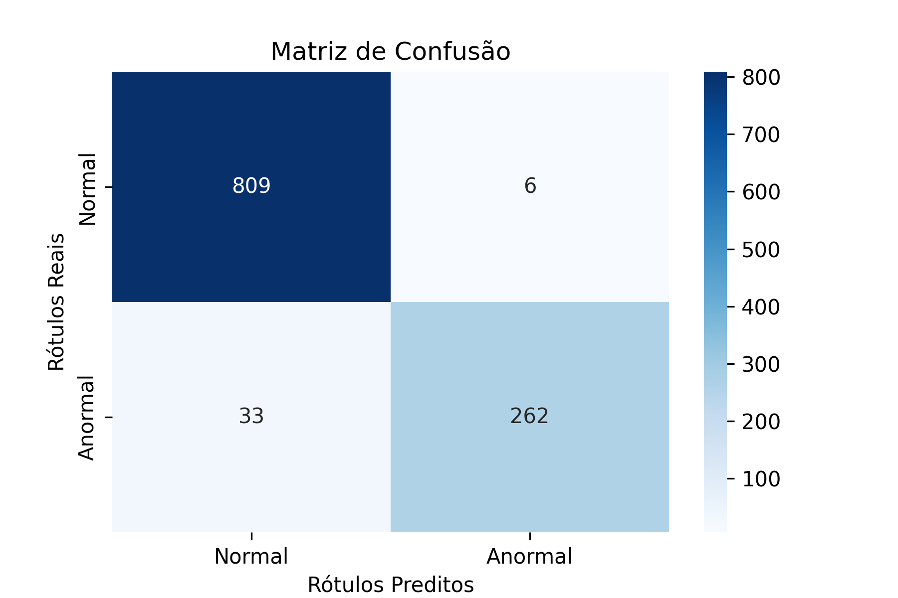
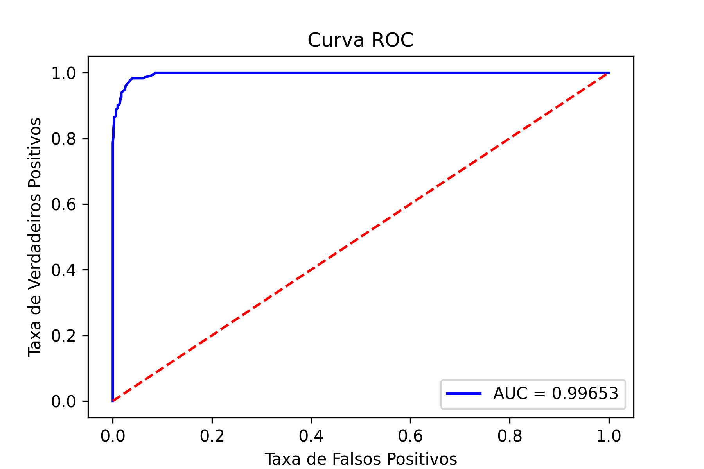

# fan-audio-fault-detection

Este projeto tem como objetivo classificar áudios de **ventiladores industriais** em normais e anormais com base em características extraídas dos sinais de áudio. Utilizamos técnicas de extração de características, como coeficientes MFCC, e um modelo Random Forest para a classificação. O MIMII Dataset foi utilizado como base de dados para os áudios dos ventiladores, com informações de condições normais e anormais das mesmas.

## Estrutura de Pastas

A estrutura de pastas deve ser configurada da seguinte forma:

```
dataset/
│
├── fan/               # Diretório principal para ventiladores (fan)
│   ├── id_00/         # Subdiretório para o modelo id_00 do ventilador
│   │   ├── normal/    # Subdiretório para arquivos normais
│   │   │   ├── 00000001.wav
│   │   │   ├── 00000002.wav
│   │   │   └── ...
│   │   ├── abnormal/  # Subdiretório para arquivos anormais
│   │   │   ├── 00000001.wav
│   │   │   ├── 00000002.wav
│   │   │   └── ...
│   ├── id_02/         # Subdiretório para o modelo id_02 do ventilador
│   │   ├── normal/    
│   │   ├── abnormal/  
│   ├── id_04/         # Subdiretório para o modelo id_04 do ventilador
│   │   ├── normal/    
│   │   ├── abnormal/  
│   ├── id_06/         # Subdiretório para o modelo id_06 do ventilador
│   │   ├── normal/    
│   │   ├── abnormal/  
```
Os arquivos de áudio dentro dos subdiretórios "normal" e "abnormal" devem seguir o formato `00000001.wav`, `00000002.wav`, etc. Esse layout é crucial para que o código consiga percorrer as pastas e processar os arquivos adequadamente.

## Fundamentação Teórica

### MFCC (Mel-frequency Cepstral Coefficients)

Os coeficientes MFCC são amplamente usados em tarefas de processamento de áudio devido à sua capacidade de representar eficientemente as características espectrais de um sinal de áudio. Eles capturam a forma da envolvente do espectro de potência em uma escala de frequência perceptualmente motivada. Essa técnica foi introduzida para o reconhecimento de fala e é fundamental no processamento de sons industriais (DAVIS; MERMELSTEIN, 1980).

### Random Forest

O algoritmo Random Forest é um método de aprendizado supervisionado que combina múltiplas árvores de decisão, proporcionando uma classificação robusta. Este algoritmo é eficaz no tratamento de dados complexos e na redução do risco de overfitting (BREIMAN, 2001).

### MIMII Dataset

O **MIMII Dataset** foi usado neste projeto como fonte de dados. Ele contém 26.092 segmentos de som de condições normais e 6.065 de condições anômalas para diferentes tipos de máquinas, incluindo ventiladores industriais. Entre as causas de falhas registradas em ventiladores estão o desbalanceamento, mudanças de voltagem e obstruções. O dataset simula cenários reais de fábrica, misturando sons de máquinas com ruídos de fundo gravados em diferentes fábricas (PUROHIT et al., 2019).

Os áudios utilizados foram extraídos do MIMII Dataset, especificamente do subset referente a ventiladores operando em condições normais e anormais com níveis de ruído de 0dB.  

As principais causas de anormalidades nos ventiladores industriais incluem:

1. **Desbalanceamento**: Desalinhamento ou desbalanceamento das partes móveis do ventilador, o que pode gerar ruídos e vibrações incomuns.
2. **Mudanças de voltagem**: Alterações na tensão elétrica que alimenta o ventilador, causando variações no seu funcionamento e no som gerado.
3. **Obstruções**: Objetos ou detritos que bloqueiam o fluxo de ar ou interferem nas hélices do ventilador, provocando ruídos adicionais e anormais.
4. **Desgaste mecânico**: Com o tempo, as peças do ventilador podem se desgastar, levando a problemas como folgas e atritos indesejados, que alteram o comportamento acústico.

Essas causas são comuns em ambientes industriais e afetam diretamente o desempenho dos ventiladores. A detecção de anomalias acústicas torna-se uma ferramenta essencial para a **manutenção preditiva**, como abordado no **MIMII Dataset**.


Link para o dataset: [MIMII Dataset](https://zenodo.org/record/3384388)

### Avaliação do Modelo

A avaliação do modelo foi feita utilizando métricas como:
- **Acurácia**: Percentual de predições corretas.
- **Matriz de Confusão**: Relaciona predições corretas e incorretas.
- **Curva ROC e AUC**: Representa a taxa de verdadeiros positivos contra a taxa de falsos positivos. A área sob a curva (AUC) é uma métrica importante para a avaliação de modelos de classificação binária (FAWCETT, 2006).

## Metodologia

### Coleta e Extração de Dados

Os dados foram coletados do MIMII Dataset, com áudios de ventiladores classificados como normais e anormais. As características dos áudios foram extraídas usando coeficientes MFCC, resultando em uma representação concisa dos sinais.

### Divisão dos Dados

Os dados foram divididos em dois conjuntos:
- **Treinamento**: 80% dos dados, usados para treinar o modelo.
- **Teste**: 20% dos dados, usados para validar o modelo.

### Treinamento do Modelo

Utilizamos o modelo Random Forest com 100 árvores de decisão para a classificação. O modelo foi treinado usando as características MFCC dos áudios. O desempenho foi avaliado com base em acurácia, matriz de confusão e curva ROC/AUC.

### Resultados

Após o treinamento, obtivemos os seguintes resultados:

#### Acurácia do Modelo

- **Acurácia**: 0.96486

#### Matriz de Confusão



A matriz de confusão acima mostra os resultados obtidos com o modelo. Foram feitas as seguintes observações:
- **Verdadeiros Positivos (Normal)**: 809
- **Falsos Negativos (Normal)**: 6
- **Falsos Positivos (Anormal)**: 33
- **Verdadeiros Negativos (Anormal)**: 262

#### Curva ROC e AUC



A curva ROC apresentada indica a performance do modelo ao longo de diferentes limiares de decisão. O valor **AUC** (Área Sob a Curva) foi de **0.99653**, o que indica uma excelente performance do modelo na distinção entre áudios normais e anormais.

## Conclusão

O modelo Random Forest demonstrou eficácia na classificação de áudios normais e anormais de ventiladores industriais. Com uma acurácia de 96,49% e uma AUC de 0,99653, o modelo mostrou-se robusto. No entanto, melhorias futuras podem incluir o aumento de dados anômalos e a utilização de redes neurais convolucionais (CNNs) para uma análise mais profunda dos sinais.

## Referências

- DAVIS, S. B.; MERMELSTEIN, P. Comparison of parametric representations for monosyllabic word recognition in continuously spoken sentences. *IEEE Transactions on Acoustics, Speech, and Signal Processing*, v. 28, n. 4, p. 357–366, 1980.
- BREIMAN, L. Random forests. *Machine Learning*, v. 45, n. 1, p. 5-32, 2001.
- PUROHIT, H.; TANABE, R.; ICHIGE, K.; ENDO, T.; NIKAIDO, Y.; SUEFUSA, K.; KAWAGUCHI, Y. MIMII Dataset: Sound Dataset for Malfunctioning Industrial Machine Investigation and Inspection. *arXiv preprint arXiv:1909.09347*, 2019.
- FAWCETT, T. An introduction to ROC analysis. *Pattern Recognition Letters*, 27(8):861–874, 2006.
